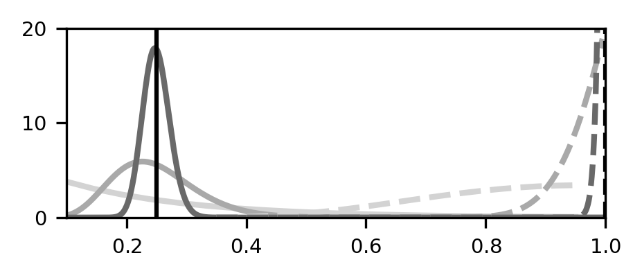
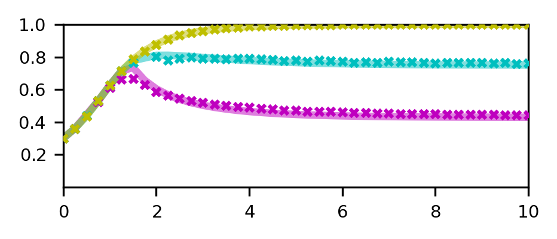

# Code for "Tuning Selection pressure..."

## Overview

[Publication](#publication)

[Brief description of Voter Model](#brief-description-of-voter-model)

[Structure of simulation code](#structure-of-simulation-code)

[Directory structure and exectuing code](#directory-structure-and-executing-code)

[Reproducing figures](#reproducing-figures)


## Publication

Manuscript published in XXX in 2024 by Thomas Tunstall. The corresponding preprint can be found on arXiv XXX.

We have included all data files and results pertinent to the manuscript (except those larger than 100MB).

## Brief description of voter model


## Structure of simulation code


## Directory structure and exectuing code

Below is a tree respresenting the structure of directories.

```
.
├── PaperFigs
├── RawFigures
└── Simulations
    ├── CoreFunctions
    ├── Fig1_InitialObservation
    ├── Fig2_CompleteDistComparisons
    ├── Fig2_CompleteDistComparisons_VaryN
    ├── Fig3_SmallC
    └── Fig4_FullTheory

```

### Directory `RawFigs`

This stores all the figures used in the publication. In order to populate it, execute:

```
$ bash Bash_Copying.sh RawFigs/
```

### Simulations

Here are the directories which house the code used to generate figures for the publication.

#### Fig1_InitialObservation

The case of a single $F,z$ choice to illustrate the nontrivial behviour of the system as $C$ is varied


#### Fig2_CompleteDistComparisons 

For $P=0.1, \Phi=10^{-5}$ we vary the length of the Selection region and calculate the change in Resistant pests over a domain so large that the periodic effects of the circular convolution have negligible effect. The result is a detailed global minimum of change in Resistance number per Selection region size with changing Selection region size.


#### Fig2_CompleteDistComparisons_VaryN

For $P=0.1, \Phi=10^{-5}$ we run the same simulation as above, except with the additional option of restricting migration to only occur during the selection phase, the post-selection phase, both phases, or neither phase. Running once for each possibility with the same 




#### Fig3_SmallC

For $P=0.1, \Phi=10^{-5}$ we run an isolated selection region case for a given $L$, for the sake of visualising how the distribution of each subpopulation changes over a generation 


#### Fig4_FullTheory

We once again vary the size of the Selection region size $L$, but for different $P$ or $\Phi$ values in `Vary_PAP` and `Vary_Phi`, respectively. This is in order to measure how the region of highest curvature changes with these values, to validate the analytical theory.





## Reproducing figures

To recreate the data, navigate to the `Host Directory` and execute the corresponding commands.

| Figure(s) | Host Directory | Commands for simulation and creating figure |
| -------------| ------------- | ------------- |
| [1c](./RawFigures/Fig1_c.png) | `Simulations/Fig1_InitialObservation` |`cp SaveFiles/Escape_Absorbing_ER_minC_0.000_maxC_10.000_Cnum_41_NodeNum_10000_minZ_0.30000_maxZ_0.30000_Znum_1_minF_0.30000_maxF_0.30000_Fnum_1_Timesteps_1000000000_SingleActive_False_Repeats_2_LargestComponent_False_DataPoints_100000000/Params.py .` <br> `python FPRunFile.py` <br> `python MultiPlotting.py -d /SaveFiles/Escape_Absorbing_ER_minC_0.000_maxC_10.000_Cnum_41_NodeNum_10000_minZ_0.30000_maxZ_0.30000_Znum_1_minF_0.30000_maxF_0.30000_Fnum_1_Timesteps_1000000000_SingleActive_False_Repeats_2_LargestComponent_False_DataPoints_100000000` |
| [2a](./RawFigures/Fig2.png) |`Simulations/Fig2_CompleteDistComparisons` | `python Plotting.py` |
| [2b](./RawFigures/Fig2_b.png) |`Simulations/Fig2_CompleteDistComparisons_VaryN` | `python Plotting.py` |
| [3c](./RawFigures/Fig3_c.png) |`Simulations/Fig3_SmallC` | `cp SaveFiles/Escape_Absorbing_ER_minC_0.000_maxC_4.000_Cnum_21_NodeNum_10000_minZ_0.01000_maxZ_0.75000_Znum_3_minF_1.00000_maxF_1.00000_Fnum_1_Timesteps_1000000000_SingleActive_False_Repeats_100_LargestComponent_False_DataPoints_100000000/Params.py .` <br> `python FPRunFile.py` <br> `python MultiPlotting.py -d SaveFiles/Escape_Absorbing_ER_minC_0.000_maxC_4.000_Cnum_21_NodeNum_10000_minZ_0.01000_maxZ_0.75000_Znum_3_minF_1.00000_maxF_1.00000_Fnum_1_Timesteps_1000000000_SingleActive_False_Repeats_100_LargestComponent_False_DataPoints_100000000` |
| [4a](./RawFigures/Fig4_a.png) |`Simulations/Fig4_FullTheory/` | `cp SaveFiles/Escape_Absorbing_ER_minC_0.000_maxC_10.000_Cnum_41_NodeNum_10000_minZ_0.30000_maxZ_0.90000_Znum_3_minF_0.30000_maxF_0.30000_Fnum_1_Timesteps_1000000000_SingleActive_False_Repeats_10_LargestComponent_False_DataPoints_100000000/Params.py .` <br> `python FPRunFile.py` <br> `python MultiPlotting.py -d SaveFiles/Escape_Absorbing_ER_minC_0.000_maxC_10.000_Cnum_41_NodeNum_10000_minZ_0.30000_maxZ_0.90000_Znum_3_minF_0.30000_maxF_0.30000_Fnum_1_Timesteps_1000000000_SingleActive_False_Repeats_10_LargestComponent_False_DataPoints_100000000/` |
| [4b](./RawFigures/Fig4_a.png) |`Simulations/Fig4_FullTheory/` | `cp SaveFiles/Escape_Absorbing_ER_minC_0.000_maxC_10.000_Cnum_41_NodeNum_10000_minZ_0.30000_maxZ_0.30000_Znum_1_minF_0.30000_maxF_0.90000_Fnum_3_Timesteps_1000000000_SingleActive_False_Repeats_10_LargestComponent_False_DataPoints_100000000/Params.py .` <br> `python FPRunFile.py` <br> `python MultiPlotting.py -d SaveFiles/Escape_Absorbing_ER_minC_0.000_maxC_10.000_Cnum_41_NodeNum_10000_minZ_0.30000_maxZ_0.30000_Znum_1_minF_0.30000_maxF_0.90000_Fnum_3_Timesteps_1000000000_SingleActive_False_Repeats_10_LargestComponent_False_DataPoints_100000000/` |
